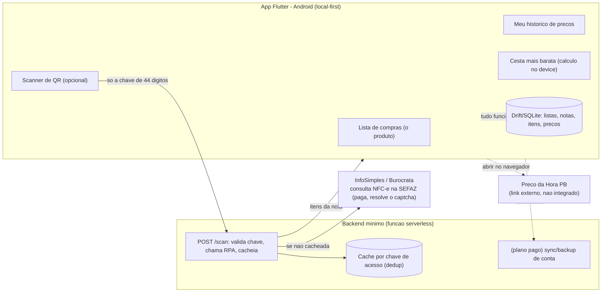
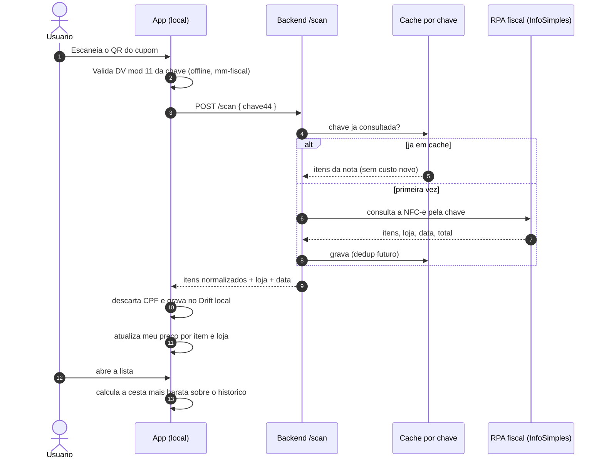
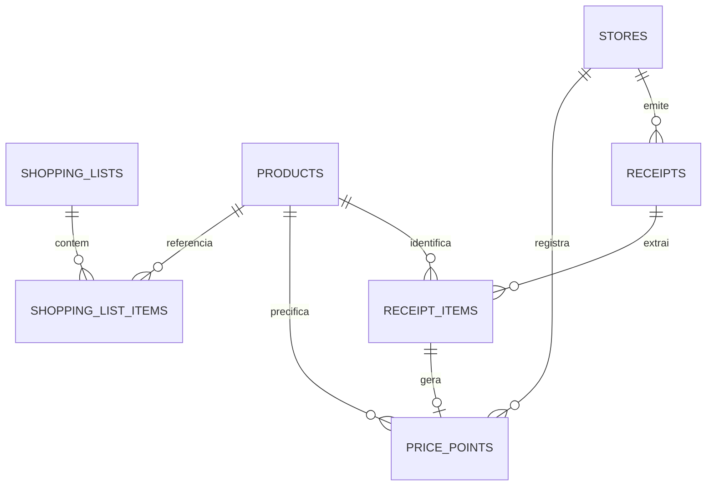

# melhor_mercado — Fase 0: Visão Arquitetural (versão enxuta)

> Data: 2026-07-22. Repo: branch `master`, **zero commits**, scaffold `flutter create` na raiz.
>
> **Esta é a versão enxuta e escolhida do produto**, decidida com o cliente em 22/07/2026: **app lista-primeiro, foco Paraíba, grátis com assinatura depois**. A versão ambiciosa anterior (rede colaborativa nacional de preços) foi arquivada em [`docs/99-versao-ambiciosa-arquivada.md`](99-versao-ambiciosa-arquivada.md) — continua valiosa como referência, e toda a pesquisa fiscal/LGPD/stack que a fundamenta segue válida em [`docs/pesquisa/`](pesquisa/).
>
> Análise do concorrente que motivou o recorte (poupa+ / poupamais.app) e verificação da SEFAZ-PB registradas em [`docs/pesquisa/analise-poupamais.md`](pesquisa/analise-poupamais.md).

---

## 1. Entendimento consolidado

O produto **não coleta preço para uma cidade** e **não compara preço de mercado em tempo real**. Esses dois jogos estão perdidos na Paraíba: o **Preço da Hora Paraíba** (TCE-PB + Governo do Estado, [br.gov.pb.precodahora](https://play.google.com/store/apps/details?id=br.gov.pb.precodahora)) já faz "onde está mais barato agora", de graça, melhor — com base fiscal de todos os 223 municípios, busca por código de barras, mapa com os 3 menores preços e rota. E os termos dessa base restringem uso comercial, então também não dá para consumi-la.

O `melhor_mercado` faz o que o Estado **não** faz e o que o concorrente poupa+ tropeça: **uma lista de compras recorrente que aprende quanto você paga.** Três camadas que degradam com elegância — cada uma útil sozinha, sem depender da anterior:

| Camada | O que faz | Dado | Vale desde |
|---|---|---|---|
| **Lista** | montar, marcar, repetir a lista da semana; lista da casa | nenhum — é sua | minuto 1, offline, sem conta |
| **Meu histórico** | escaneou o cupom → "quanto **eu** paguei nesse item"; preenche o preço da lista sozinho | NFC-e do próprio usuário (opcional) | 1º scan |
| **Minha cesta mais barata** | "sua lista sai R$ X no Assaí, R$ Y no Bemais — **com base no que você pagou**" | o próprio histórico do usuário | quando houver 2+ lojas no histórico |

### Core loop

```
[1] usuário monta/repete a lista       →  útil já aqui, sem preço nenhum
[2] no mercado, marca o que pegou       →  a lista funciona offline
[3] (opcional) escaneia o cupom fiscal  →  preenche "quanto eu paguei" sozinho
[4] o app aprende os preços por loja     →  vira memória pessoal
[5] próxima lista mostra "mais barato onde você compra"
```

O que muda tudo em relação ao poupa+ (e à versão ambiciosa): a comparação é sobre **o seu próprio dado**. Isso é **honesto** ("com base no que você pagou", nunca "preço de mercado"), funciona **single-player** (zero cold start, zero quórum, zero moderação, zero catálogo nacional, zero antifraude) e **não briga** com o app do Estado — que pode até ser linkado como "conferir preço atual na sua cidade".

### O que o poupa+ nos ensinou a fazer diferente

- **Conta é opcional, não obrigatória.** O poupa+ exige login antes de qualquer valor — a dor #4 da categoria. Aqui a lista e o scan funcionam local, sem conta; conta só para sync/backup (plano pago).
- **A lista é o herói, não o scanner.** Apps de lista têm ~100x a tração de apps de cupom puro. O FAB de scan continua central, mas a Home abre na **lista**, não em "Ticket médio".
- **Preço por unidade base sempre** (R$/kg, R$/L) — o maior buraco funcional do poupa+.
- **Data e nº de observações à vista**, e o rótulo honesto: "seu preço de 25/abr", nunca uma "faixa de preço" que finge ser mercado.
- **Assumir que o scan falha.** Caminho de recuperação (reenfileirar, tentar de novo, entrada manual do item) desenhado junto com o caminho feliz.

---

## 2. Suposições adotadas

| # | Suposição | Se falsa |
|---|---|---|
| S1 | Foco **Paraíba** (João Pessoa/Campina Grande), aproveitando a rede do Sertão Desenvolve para distribuição | muda a praça, não a arquitetura |
| S2 | **Um desenvolvedor**, grátis no MVP, assinatura depois | escala do roadmap |
| S3 | Scan é **opcional e de baixo volume** → InfoSimples a R$ 100/mês fixo é aceitável no piloto | se o scan virar gesto central e volumoso, o custo cresce e força negociar RPA ou XML |
| S4 | Comparação de cesta é sobre o **histórico do próprio usuário**, não colaborativa | se quiser comparar entre usuários, reintroduz cold start, moderação e LGPD pesada |
| S5 | **Local-first**: lista, histórico e comparação vivem no dispositivo (Drift/SQLite); backend é fino | se precisar de sync desde o dia 1, o backend cresce |
| S6 | GTIN **não** vem da consulta pública da NFC-e → matching por texto | se um dia houver XML/GTIN, o matching melhora |
| S7 | Manter Flutter (já scaffoldado) | poupa+ usa Expo/RN; ambos servem — decisão de ecossistema |

---

## 3. Arquitetura recomendada

**Local-first no app + backend mínimo só para o scan.** O peso está no dispositivo; o servidor existe por dois motivos apenas: guardar a chave da API de leitura fiscal (que nunca pode ir no app) e **deduplicar por chave de acesso** para não pagar duas vezes pela mesma nota.

### 3.1 Componentes



O que **não** existe aqui (e existia na versão ambiciosa): PostGIS, quórum de publicação, reputação de contribuinte, moderação de UGC, catálogo canônico global, fila de curadoria, otimizador MILP nacional, réplica de leitura, fila assíncrona pesada. Nada disso é preciso para um app single-player local-first.

### 3.2 Da foto ao preço na lista



### 3.3 Decisões técnicas

| # | Decisão | Porquê |
|---|---|---|
| 1 | **Local-first (Drift/SQLite no device)** | a lista precisa funcionar no corredor do mercado, onde o 4G é ruim; e elimina backend no caminho quente |
| 2 | **Conta opcional** | remove a dor #4 da categoria (login obrigatório); conta só habilita sync/backup no plano pago |
| 3 | **Leitura fiscal via RPA pago (InfoSimples), atrás de um proxy** | a SEFAZ-PB **exige captcha** (verificado) e o projeto não contorna captcha; a InfoSimples resolve legitimamente. O proxy guarda a chave da API e deduplica por chave de acesso |
| 4 | **Comparação sobre o histórico do próprio usuário** | honesto, sem cold start, sem moderação; não compete com o grátis-superior do Estado |
| 5 | **Não integrar o Preço da Hora PB** | termos restringem uso comercial e não há API pública legítima; no máximo, link externo |
| 6 | **Matching de produto por texto (sem GTIN)** | a consulta pública da NFC-e não devolve GTIN; normalização leve + categoria derivada resolve o essencial |
| 7 | **Flutter** (mantém o scaffold) | já validado por build real na pesquisa de stack; RN seria igualmente válido |
| 8 | **Sem CPF, nunca** | o cupom pode trazer CPF; descartar na ingestão, antes de qualquer gravação |

---

## 4. Modelo de dados (local-first)

No dispositivo, via Drift. Simples e sem geografia pesada.



**Tabelas e o que importa em cada uma:**

- `shopping_lists` — id, nome, é_recorrente, criada_em. O objeto de uso diário.
- `shopping_list_items` — lista_id, product_id (nullable — item pode ser texto livre "pão"), quantidade, marcado, preço_estimado (do histórico). **Item pode existir sem produto casado**: a lista funciona antes de qualquer scan.
- `products` — chave_normalizada, nome, categoria, unidade_base (`G`/`ML`/`UN`), quantidade_embalagem. Catálogo **local e leve**, construído dos próprios cupons + dicionário de abreviações semeado.
- `stores` — cnpj, nome_normalizado (razão social → marca: "COOPERATIVA..." → "Cooper Fresh"), cidade. Aplicar a marca **em todas as telas** (o poupa+ vaza a razão social crua na tela de sucesso).
- `receipts` — **chave_acesso UNIQUE**, loja_cnpj, emitida_em, total, fonte (`qr`/`manual`). A UNIQUE é o que impede a mesma nota entrar duas vezes.
- `receipt_items` — receipt_id, descrição_crua (xProd), product_id, quantidade, unidade, preço_unitário, total, categoria.
- `price_points` — product_id, store_cnpj, preço, preço_por_unidade_base, observado_em, receipt_id. **É a base da comparação** — derivado dos itens, indexado por (product_id, store_cnpj).

Backend (mínimo): tabela `scan_cache` (chave_acesso → JSON da nota, para dedup) e, no plano pago, `user_sync`.

**Preço por unidade base** é calculado na ingestão e guardado, porque é o que torna a comparação honesta: `R$ 5,19 /L` ao lado de `R$ 4,98 (900ml → R$ 5,53/L)`.

---

## 5. Telas do MVP

Inventário enxuto, a **lista no centro**:

1. **Onboarding leve** — 2 telas, sem conta obrigatória; pede cidade uma vez (texto, sem GPS).
2. **Minha lista** (Home) — a lista recorrente, com total estimado e "mais barato onde você compra". Abre aqui, não em estatística.
3. **Adicionar item** — busca no catálogo local + digitar livre; sugestão dos itens que você sempre compra.
4. **Scanner de QR** (FAB central) — com gate de nitidez; assume que pode falhar.
5. **Processando / resultado do scan** — preview progressivo dos itens (não tela vazia por 7s como o poupa+); ao final, **um insight**, não só um recibo ("você pagou R$ 0,30 a mais no arroz que da última vez").
6. **Detalhe do produto** — "meu preço" por loja, com data e nº de observações; preço por unidade base; **sem gráfico enganoso** (só mostra série quando há pontos reais suficientes).
7. **Minha compra** (detalhe da nota) — itens, total, desconto em destaque; poder apagar.
8. **Cesta mais barata** — "sua lista: R$ X no Assaí, R$ Y no Bemais", itens sem histórico marcados honestamente.
9. **Conta e privacidade** — criar conta (opcional, para sync), exclusão de conta, exportar dados.

**Estados obrigatórios** (o que o cliente sempre pediu): carregando, vazio ("adicione seu primeiro item"), erro, **sem conexão** (a lista continua funcionando), **scan falhou** (tentar de novo / digitar / salvar para depois), **sem histórico ainda** (a comparação explica que aprende com o uso).

---

## 6. O algoritmo da "cesta mais barata sobre o seu histórico"

Simples e honesto — nada de MILP. Para cada item da lista, olhar o `price_point` mais recente por loja; somar por loja; mostrar o ranking. Regras que evitam enganar:

- **Só compara `base_unit` igual** (R$/kg com R$/kg).
- **Preço tem validade visível**: acima de N dias vira "seu preço antigo" e não encabeça sem aviso.
- **Item sem histórico é listado como tal** ("você ainda não registrou preço de X") — nunca somado como zero.
- **Economia como diferença explícita e honesta** ("R$ 12 a menos no Assaí, com base nos seus últimos preços"), não uma promessa de mercado.
- É `O(itens × lojas)` sobre dados locais do usuário — instantâneo, roda no device, sem servidor.

Reaproveita o pacote `mm-fiscal` já projetado (parser de QR nos 4 formatos, DV, GTIN, detecção de RCN) — que continua sendo o que o scan precisa.

---

## 7. Decisão de leitura fiscal (verificado em 2026-07-22)

| Caminho | Situação | Veredito |
|---|---|---|
| **Ler a SEFAZ-PB direto (nosso código)** | O portal `sefaz.pb.gov.br/nfce` redireciona para função de segurança e **exige captcha** (confirmado). | **Fora** — o projeto não contorna captcha. Não é falta de habilidade, é regra. |
| **InfoSimples** | RPA que resolve o captcha do lado deles. Retorna itens, quantidades, valores. **Sem GTIN.** R$ 100/mês fixo, ~R$ 0,20/consulta acima de ~500 notas. | **Via do MVP.** No volume de um app lista-primeiro (scan opcional), R$ 100/mês fixo é aceitável. |
| **Burocrata** | Concorrente da InfoSimples, mesmo modelo. | Alternativa/backup a validar por preço. |
| **XML do emitente** | O consumidor pode pedir o XML (tem GTIN). | Inviável em escala; talvez opção avançada futura. |

**Proxy obrigatório:** o app manda só a chave de 44 dígitos; o backend guarda a chave da API de RPA e **cacheia por chave de acesso** — a mesma nota nunca é paga duas vezes, e um mesmo cupom escaneado de novo é grátis.

---

## 8. Roadmap enxuto

Dias-dev para um desenvolvedor. Muito menor que a versão ambiciosa (~114 d) porque não há a máquina colaborativa.

| Fase | Objetivo | Escopo | Est. |
|---|---|---|---|
| **0** | Fundação | reestruturar repo; app Flutter navegando; Drift local; CI | 4 d |
| **1** | **Lista** | criar/editar/repetir lista; catálogo local; total estimado; offline. **Já é útil e publicável** | 8 d |
| **2** | Scan | `mm-fiscal` (QR + DV); proxy `/scan` → InfoSimples com cache por chave; tela de resultado com insight | 10 d |
| **3** | Meu histórico | `price_points`; detalhe do produto com "meu preço" por loja; preço por unidade base; normalização razão social → marca | 8 d |
| **4** | Cesta mais barata | algoritmo sobre o histórico; estados de "sem histórico"; economia honesta | 6 d |
| **5** | Conta e publicação | conta opcional + sync (Supabase); exclusão/exportação; LGPD; ativos de loja; targetSdk 36; piloto na PB | 8 d |
| | | **Total** | **~44 d** |

**Plano pago (pós-piloto):** lista compartilhada da casa, alerta de aumento de preço, histórico estendido, multi-dispositivo, exportação. Cobrança pela Google Play, como o poupa+ já preparou nos termos.

---

## 9. Principais riscos

| # | Risco | Indicador | Gatilho | Mitigação |
|---|---|---|---|---|
| R1 | **Retenção** — a lista precisa ser boa o bastante para uso diário, senão o scan (corveia semanal) não sustenta o hábito | usuários que voltam na semana 4 | < 25% | investir a Fase 1 na lista, não no scanner; alerta e lista compartilhada cedo |
| R2 | **Scan falha** (a dor #1 do poupa+, que virou release note deles) | taxa de sucesso do scan | < 90% | gate de nitidez no device; fila de retry; entrada manual do item; cache por chave |
| R3 | **Custo da leitura fiscal** cresce se o scan virar volumoso | consultas/mês na InfoSimples | > 500/mês | dedup por chave (já previsto); scan é opcional; renegociar RPA ou pedir XML |
| R4 | **Matching por texto** junta/separa produtos errados (sem GTIN) | correções manuais do usuário | alta | normalização leve + o usuário confirma; nunca auto-unir tamanhos/sabores diferentes |
| R5 | **Cupom em papel** deixando de ser obrigatório | — | — | aceitar chave colada / QR na tela do PDV como entrada alternativa |
| R6 | **O Estado (Preço da Hora PB) já resolve comparação** | — | — | não competir nesse eixo; nosso valor é lista + "meu preço" + hábito, não "preço da cidade" |

---

## 10. Critérios de conclusão do MVP

1. A lista é criada, repetida e usada **offline, sem conta, com valor no minuto 1**.
2. Escanear o QR de uma NFC-e da PB traz os itens em < 10 s; a mesma nota escaneada de novo não gera custo nem duplicata.
3. Cupom com CPF sai do pipeline sem CPF gravado em lugar nenhum.
4. Todo preço mostra loja (marca, não razão social), data e nº de observações; e preço por unidade base.
5. "Cesta mais barata" compara só `base_unit` igual, marca itens sem histórico, e nunca chama de "preço de mercado".
6. Os 6 estados obrigatórios (incl. sem conexão e scan falhou) têm tela e saída.
7. Conta é opcional; exclusão e exportação funcionam.
8. Piloto na PB: um punhado de usuários reais registra ≥ 4 compras cada e a comparação de cesta faz sentido para eles.

---

## Decisões suas que ainda faltam (nenhuma bloqueia a Fase 0)

1. **InfoSimples vs. Burocrata** — validar preço real da consulta PB de ambos antes da Fase 2.
2. **Flutter vs. Expo/RN** — mantenho Flutter (já scaffoldado) salvo preferência sua.
3. **Nome/marca** — "melhor_mercado" é o nome de trabalho; vale decidir o nome público e o pacote antes da publicação (o poupa+ colide com serviços homônimos — evite essa armadilha).
