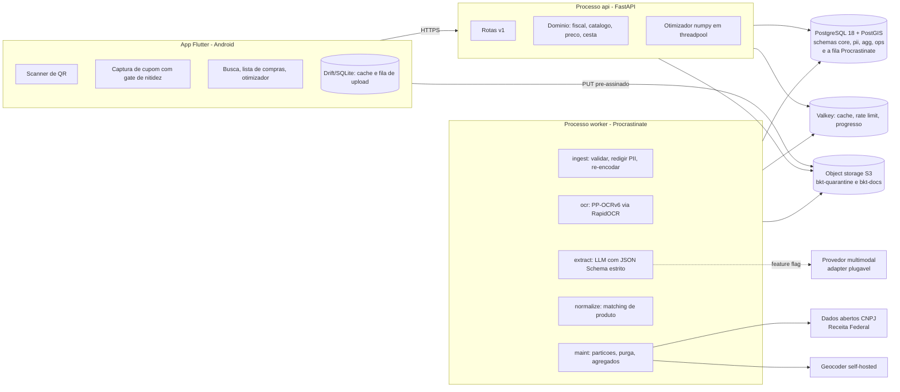
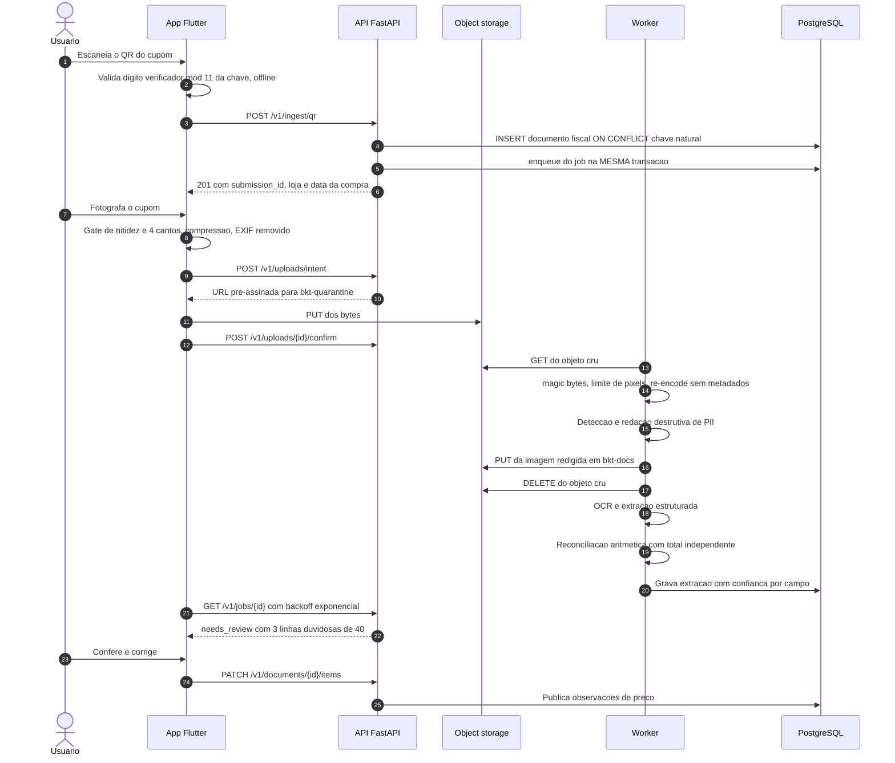
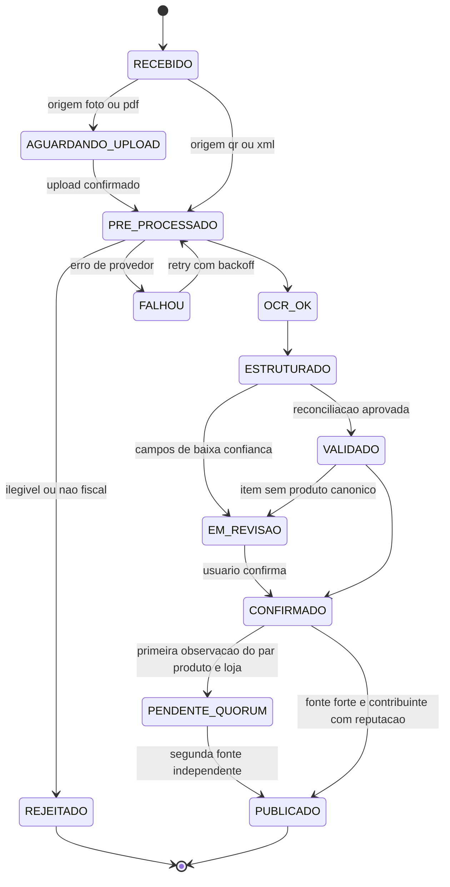
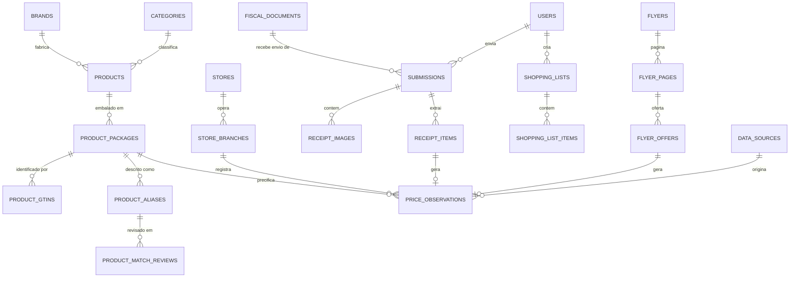

# melhor_mercado — Fase 0: Visão Arquitetural

> Documento de fundação. Data: 2026-07-22. Estado do repo na redação: branch `master`, **zero commits**, apenas scaffold `flutter create` na raiz.
>
> Toda afirmação factual deste documento tem lastro em pesquisa verificada em 22/07/2026, registrada em [`docs/pesquisa/dossie-tecnico-2026-07-22.md`](pesquisa/dossie-tecnico-2026-07-22.md). A revisão adversarial que corrigiu a primeira versão está em [`docs/pesquisa/critica-adversarial-2026-07-22.md`](pesquisa/critica-adversarial-2026-07-22.md).

---

## 1. Entendimento consolidado do produto

O `melhor_mercado` **não é um comparador de preços com dados prontos**. Não existe, no Brasil de 2026, nenhuma fonte de preços de supermercado reutilizável comercialmente em escala nacional. O produto é, na prática, **uma rede colaborativa de observações de preço com um motor de decisão em cima** — e o ativo defensável é a *densidade de cobertura por praça*, não o software.

Três achados de pesquisa reformatam o produto antes da primeira linha de código:

**(a) O QR Code da NFC-e não contém os itens da compra.** Nenhuma versão (1.00, 2.00, 3.00) nem o CF-e-SAT carregam produto, quantidade ou preço unitário. O QR carrega a chave de acesso de 44 dígitos + 2 a 7 metadados + a URL de consulta da UF. O único valor monetário presente é o total (`vNF`), e apenas em contingência offline. Qualquer plano de produto do tipo "leia o QR e tenha a lista de compras" está errado na premissa.

**(b) Consultar a página da SEFAZ para obter os itens é inviável e ilegítimo.** Teste HTTP em 22/07/2026: RS usa hCaptcha; SP e MG usam reCAPTCHA; SC usa Cloudflare Turnstile; GO devolve 403 (WAF); RJ bloqueia por reputação de IP; o Portal Nacional usa reCAPTCHA. Não existe API pública oficial de consulta de NFC-e sem certificado ICP-Brasil, e os web services punem `Consumo Indevido` com a rejeição 656. **Contornar qualquer um desses controles está fora do escopo do projeto.**

**(c) As fontes oficiais estaduais existem, mas quase todas proíbem uso comercial.** O Termo de Uso do Menor Preço/PR (CELEPAR) veda literalmente uso comercial, robôs e "aplicações de *Pricing*". Os Termos do Preço da Hora/BA restringem a "uso pessoal e não comercial" e vedam retransmissão. O Menor Preço Brasil (CONFAZ, 21 UFs + DF) exige login gov.br justamente como antirraspagem. **Alagoas é a única UF com API pública documentada e programa formal de parceiros** — e cobre um estado.

**Consequência:** o único canal com cobertura nacional e base jurídica sólida é o **documento fiscal que o próprio usuário possui**. O QR entra como *âncora de identidade* (chave, CNPJ do emitente, UF, competência, e o total quando offline), que deduplica, geolocaliza e data a compra **antes** de qualquer OCR — barateando e validando a extração. Os itens vêm de OCR da foto, ou do XML quando o usuário o obtém do emitente.

### Core loop

```
[1] usuário escaneia o QR  →  identidade da nota em <1s, sem custo de IA
[2] usuário fotografa o cupom  →  gate de nitidez no device, upload em background
[3] pipeline extrai e reconcilia aritmeticamente
[4] usuário confere APENAS as 0–3 linhas de baixa confiança, não as 40
[5] preços entram na base da praça com fonte, data e confiança
[6] usuário monta a lista e recebe o plano de compra com economia estimada
```

O passo **[6] precisa pagar o esforço do passo [2]**. Enquanto a densidade da praça não existir, ele não paga — e é por isso que a semeadura de cobertura é tratada aqui como **fase de produto**, não como ação de marketing pós-lançamento. Este é o modo de falha que aparentemente matou o concorrente mais próximo (Economiza Club, Porto Alegre, 2015, mesmo modelo de QR + base colaborativa; hoje o domínio nem mantém HTTPS).

### O que o produto entrega, em uma frase honesta

> Descubra onde sua compra sai mais barata usando preços obtidos de cupons fiscais reais da sua região — sempre com a data, a fonte e o grau de confiança de cada preço à vista.

O qualificador final não é cosmético: é o que sustenta a base legal (art. 6º, V da LGPD — qualidade dos dados) e a defesa contra o art. 37, §3º do CDC (enganosidade por omissão).

---

## 2. Suposições adotadas

Consolidadas em `docs/suposicoes.md` com dono, prazo e forma de validação. As que mais mudam o desenho:

| # | Suposição | Impacto se falsa | Como validar |
|---|---|---|---|
| S1 | **Praça piloto onde a NFC-e (mod. 65) domina** — adotado João Pessoa/PB como padrão | Em SP o documento dominante é o CF-e-SAT (mod. 59), com chave e QR de layout **diferente**; o parser e a prioridade de OCR mudam | Decisão do dono do produto. Bloqueia a Fase 1.5, não a Fase 0 |
| S2 | **Um desenvolvedor**, sem equipe de curadoria dedicada | Roadmap e orçamento de curadoria humana mudam de escala | Declarado |
| S3 | **Sem receita no MVP**; orçamento de infra ≈ US$25/mês no piloto | O circuit breaker de custo de IA vira o limitador de crescimento | Medir custo/documento desde o cupom nº 1 |
| S4 | Manter a imagem crua em bucket de quarentena por **minutos** (até a redação) é aceitável sob LGPD, desde que o objeto seja destruído e nenhuma outra role tenha acesso | Se um parecer exigir "nunca persistir o cru", o upload vira multipart pela API — pior UX, mais custo | Parecer jurídico antes da Fase 2 |
| S5 | Conta Google Play de **organização** (CNPJ + D-U-N-S) | Conta pessoal impõe 12 testadores por 14 dias corridos antes da produção — semanas de atraso | Iniciar D-U-N-S imediatamente |
| S6 | O benchmark do otimizador (0,3–3,2 ms) foi medido em Apple M5 Pro; **em container Linux de 1–2 vCPU será materialmente mais lento** | O SLO de p95 do endpoint mais valioso do produto | Re-medir em container antes de publicar qualquer SLA |
| S7 | Localização **aproximada** (~100 m, `ACCESS_COARSE_LOCATION` ou CEP digitado) é suficiente para o ranking | Se o produto exigir raio de 1 km, sobe para `ACCESS_FINE_LOCATION` e, com targetSdk 37, para o *location button* — hoje uma lib alpha, Compose-only, sem caminho oficial em Flutter | Métrica de qualidade do ranking no piloto |
| S8 | Extração estruturada por **um único** provedor LLM barato, atrás de feature flag, com OCR self-hosted como base | Manter 5 provedores multiplica DPA, custo jurídico e manutenção sem melhorar SLO | Gold set anotado |
| S9 | Nenhum encarte é ingerido sem **autorização escrita** da rede | O modelo de crescimento que atribui ~25% das observações a encartes não se realiza sem um programa comercial que ainda não existe | Refazer a projeção com cenário de zero encartes |
| S10 | GTIN estará **ausente** em fração relevante dos itens | A normalização por descrição é caminho crítico, não refinamento posterior | Medir nos primeiros 10 mil itens |

---

## 3. Arquitetura recomendada

### 3.1 Forma

**Monolito modular em FastAPI + um worker Procrastinate, sobre um único PostgreSQL.** Três processos de longa duração até ~10k MAU:

| Processo | Papel |
|---|---|
| `api` | uvicorn, 1 processo por container. Rotas, domínio, otimizador (em threadpool) |
| `worker` | Procrastinate, filas `ingest, ocr, extract, normalize, maint`, concorrência 4 |
| `postgres` | PostgreSQL 18.4 + PostGIS 3.6 + pgvector. **Também é o broker da fila** |

Rejeitada a topologia de 16 processos (api 2-N, worker-ingest, worker-ocr, ocr-engine, worker-normalize, worker-maint, réplica de leitura, Valkey): para um desenvolvedor solo isso é US$200–400/mês de compute ocioso antes do primeiro usuário. O motor de OCR é **uma biblioteca importada no worker**, não um serviço HTTP.

### 3.2 Princípios (invariantes de código, não recomendações)

1. **Toda observação de preço tem fonte, data de observação e confiança.** Não existe caminho que grave preço sem os três.
2. **O QR é identidade, nunca conteúdo.** Itens só vêm de OCR, XML ou digitação.
3. **A extração nunca sobrescreve silenciosamente uma decisão humana.** `decided_by='human'` tem precedência sobre qualquer reprocessamento.
4. **Reconciliação aritmética é requisito, não feature.** É a única rede contra alucinação numérica — mas só vale se o total for obtido por **canal independente** do extrator (regex ancorada no rodapé do OCR, ou `vNF` do QR). Comparar a soma dos itens do LLM contra o total do mesmo LLM é tautológico.
5. **Provedores de OCR e de extração são plugáveis.** Nenhum SDK de fornecedor é importado fora da camada de infraestrutura.
6. **Identidade é passivo.** CPF nunca é persistido, em nenhuma forma — nem hash, nem HMAC (o espaço de ~10⁹ CPFs torna a reversão trivial; sob o art. 12 continua dado pessoal).
7. **Publicado XOR alerta.** Extração inválida nunca é publicada sem um alerta tipado registrado.
8. **Promoção vencida nunca aparece como preço atual.** Vigência é atributo de primeira classe da oferta.
9. **Honestidade estatística.** Economia é faixa (p10–p90), nunca número único; a copy é "entre as melhores combinações", nunca "a mais barata". Medição própria: com ruído de 5% nos preços, o conjunto recomendado permanece ótimo em apenas 56% das simulações, mas o custo excede o ótimo verdadeiro em apenas 0,33% em média — o custo é robusto, a identidade do conjunto não é.
10. **O caminho quente do usuário não faz I/O de terceiro.** Nem JWKS remoto, nem geocoder, nem provedor de IA.

### 3.3 Decisões técnicas principais (ADRs resumidos)

| ADR | Decisão | Alternativas descartadas e porquê |
|---|---|---|
| 001 | Monolito modular, 3 processos | Microsserviços: zero benefício com 1 dev; custo operacional proibitivo |
| 002 | Processamento **assíncrono** com polling + backoff no MVP | SSE/WebSocket: incompatível com PgBouncer em transaction pooling e sem valor antes de escala |
| 003 | Fila = **Procrastinate 3.9 no próprio Postgres** | Celery/Dramatiq+Redis: exigem broker novo e perdem o *enqueue transacional* (documento + job na mesma transação), que é a resposta limpa para idempotência de nota reenviada. Mitigação do risco de projeto pequeno: porta `TaskQueue` isolando o enqueue |
| 004 | Driver **psycopg3** para tudo (`postgresql+psycopg://`) | asyncpg: não é suportado pelo Procrastinate e tem a armadilha de prepared statements atrás de PgBouncer |
| 005 | OCR **self-hosted** (PP-OCRv6 via RapidOCR/ONNX) + **um** extrator LLM barato atrás de feature flag | Tesseract: falha estrutural em bobina térmica (LSTM assume linha contínua; fonte matricial é descontínua por construção). Parsers gerenciados de recibo: US$10/1k páginas e não modelam CNPJ, chave de acesso nem código interno do produto |
| 006 | Identidade do produto = **chave sintética**, nunca o GTIN | GTIN iniciado em `2` (ou GTIN-8 em `0`/`2`, ou GTIN-14 com indicador `9`) é *Restricted Circulation Number* — código interno de loja/balança que **colide entre redes**. Usar como chave global mistura o queijo de uma rede com o frios de outra |
| 007 | Matching **determinístico primeiro**, embeddings depois | O benchmark WDC Products mostra baseline simbólico superando RoBERTa fine-tuned em datasets pequenos/médios. Adicionar uma abreviação ao dicionário rende mais que uma rodada de fine-tuning |
| 008 | Otimizador = **enumeração exata vetorizada em numpy**, fora do event loop | MILP: CP-SAT resolve 30×20 K=3 em 12,5 ms, mas com 1 worker degrada para 1.008 ms e prova o ótimo em só 42% dos casos — inviável em container de 1 vCPU. Medição própria: enumeração vetorizada é 10–30× mais rápida que CP-SAT nos tamanhos reais. **Ponto de virada: ~200.000 subconjuntos** |
| 009 | Redação de PII **antes** da persistência durável, com re-encode destrutivo | Redação posterior deixa janela em que o bucket contém CPF legível — e backups capturam exatamente esse estado |
| 010 | Storage **Cloudflare R2** | S3: no cenário de escala, ~1,6 TB/mês de egress = ~US$144/mês contra US$0 no R2 |
| 011 | **Sem MinIO** | Repositório arquivado; última imagem de 2025-09-07; a release de segurança de 2025-10-15 nunca foi publicada como imagem. Dev usa SeaweedFS ou Garage |
| 012 | **Sem freezed** no app | Não existe conjunto resolvível hoje com freezed estável + riverpod codegen + drift codegen (fratura analyzer 12 vs 13). Solução validada por build real: `sealed`/`final class` nativas do Dart 3.12 + pattern matching + json_serializable |

### 3.4 Diagrama de componentes



### 3.5 Fluxo de processamento: da foto ao preço publicado



### 3.6 Ciclo de vida do documento



### 3.7 Confiança e qualidade do preço

Um preço nasce com peso `w = C_fonte × 0,5^(idade/meia_vida)` e é publicado somente sob **quórum**: o par `(embalagem, filial)` entra na comparação com ≥2 observações de contribuintes distintos e não correlacionados, **ou** 1 observação de fonte forte (XML/QR) de contribuinte com reputação acima do piso. Abaixo disso o preço é gravado mas fica `PENDENTE_QUORUM` — invisível na comparação.

O gate de anomalia é **simétrico**: `v < 0,60 × mediana` **e** `v > 1,40 × mediana` disparam quarentena. Inflar o preço de um concorrente é o ataque comercialmente relevante, e um gate que só detecta deflação passa direto por ele. Quando não há histórico local (que é o caso de *toda* loja durante a semeadura), o baseline é a mediana regional do município e, na falta, a nacional do pacote.

**Um preço nunca é apagado automaticamente por ser diferente**: ele é rebaixado em confiança e marcado para revisão.

Todas as constantes (confiança por fonte, meia-vida, limiares, λ) vivem numa **única tabela versionada** (`core.price_confidence_params`), com teste que falha se qualquer equivalente aparecer literal em código.

---

## 4. Modelo de dados inicial

Quatro schemas com separação **física** de responsabilidade:

- `pii` — usuários, credenciais, consentimentos. Role própria. **A role que serve a busca de preços não tem GRANT aqui**, o que torna vazamento de PII por SQL injection na rota pública estruturalmente impossível.
- `core` — catálogo, geografia, documentos fiscais, fatos de preço.
- `agg` — agregados de leitura (preço corrente, séries diárias).
- `ops` — jobs, auditoria, revisão, fontes de dados.

### 4.1 Entidades



Entidades adicionais sem aresta no diagrama: `units`, `retailer_item_codes`, `document_hashes`, `price_confirmations`, `price_alerts`, `content_reports`, `extraction_jobs`, `extraction_corrections`, `audit_logs`, `access_logs`, `consents`, `refresh_tokens`, `user_deletion_requests`, `market_areas`, `uf_fiscal_endpoints`, `abbreviations`, `price_confidence_params`.

### 4.2 As 14 decisões de modelagem que importam

1. **`fiscal_documents` ≠ `submissions`.** O documento fiscal é o *fato* (une contribuições e alimenta preço); a submissão é o *recurso do usuário*. Sem essa separação, o segundo remetente de um mesmo cupom passaria a ler a cesta de compras de outra pessoa — vazamento por design, agravado porque cesta de supermercado revela categoria sensível por inferência (medicamento, fralda geriátrica, teste de gravidez).

2. **Chave natural, não chave de acesso, como unicidade do documento:** `UNIQUE (cuf, cnpj_emitente, modelo, serie, numero, tp_emis) NULLS NOT DISTINCT`. A chave de 44 dígitos contém `cNF` aleatório e é frágil para deduplicar entre origens (QR vs OCR com um dígito errado).

3. **CF-e-SAT tem layout de chave diferente da NFC-e** e exige parser próprio: `nserieSAT = k[22:31]`, `nCF = k[31:37]`, `cNF = k[37:43]`, sem `tpEmis`. Aplicar os offsets da NF-e a uma chave modelo 59 produz lixo silencioso — e, com `series`/`number` nulos, **todos os cupons SAT da mesma loja colapsam num único registro**. Roteamento por `chave[20:22]`: `65`→NFC-e, `55`→NF-e, `59`→CF-e-SAT.

4. **GTIN sempre em `CHAR(14)` zero-preenchido**, com `gtin_format` guardando o formato original. A função `is_rcn` opera **exclusivamente sobre a forma canônica de 14** — a armadilha é que `2001234500008` padded vira `02001234500008`, e um teste em `gtin[0]` retorna falso justamente no caso mais comum de RCN. Regra correta: RCN se `g[0]=='9'` ou `g[1]=='2'` ou `g[:3] ∈ {'000','002','004'}`. **Uma única implementação**, em pacote compartilhado, com `is_rcn` também como coluna gerada no banco para que aplicação e banco não possam divergir.

5. **Preço em `numeric(12,2)` na tabela, `int64` em centavos no otimizador.** Dinheiro nunca passa por `float` — `float('1.005')*100` dá `100.49999999999999`.

6. **Comparação só entre a mesma `base_unit`.** `AND base_unit = :base_unit` é obrigatório em toda query de ranking, com CHECK de invariante e teste de arquitetura que falha o CI se um `ORDER BY base_unit_price` aparecer sem ele. Ordenar R$/g junto com R$/mL produz um ranking plausível e sem sentido.

7. **Preço por unidade base nunca esconde o preço da embalagem.** O componente de preço é um bloco só: preço da embalagem dominante, preço por kg/L/un secundário, rótulo de embalagem, e o selo de frescor + fonte.

8. **Item de peso variável é classe própria.** Se `uCom ∈ {KG,G}` ou `qCom` não é inteiro ou o GTIN é RCN → `is_variable_weight`, comparado **sempre** por preço por quilo. "Tomate 0,732 KG" nunca se compara com "Tomate UN".

9. **`price_observations` particionada por mês**, com a partição derivada de `ingested_month` (estável), **não** de `observed_at`. Se a partição vier de `observed_at`, um reprocessamento que corrija a hora de emissão não encontra o conflito e insere duplicata — quebrando exatamente o critério "o mesmo documento não gera observação duplicada".

10. **`dedupe_key` não embute `user_id` em texto.** Usa `sha256(user_id ‖ pepper_do_usuário ‖ ...)`: preserva idempotência e unicidade, e a exclusão do pepper na exclusão de conta destrói a reversibilidade — inclusive nas partições já arquivadas.

11. **Auditoria em duas tabelas com retenções distintas:** `audit_logs` (ação, ator, entidade — sem IP/UA) e `access_logs` (IP/UA — **exatamente 180 dias**, que é obrigação *e teto* do art. 15 do Marco Civil). Trigger de imutabilidade `FOR EACH ROW` na tabela-mãe (a variante `FOR EACH STATEMENT` **não** intercepta DML direto na partição — verificado: `DELETE FROM audit_logs_2026_07` apaga sem exceção), role de escrita com `INSERT` apenas, e cópia append-only para armazenamento WORM externo.

12. **Toda leitura de PII é auditada.** `document.image.viewed`, `extraction.viewed`, `pii.exported` — sem isso a plataforma não consegue responder "quem viu o quê" num incidente.

13. **`raw_output` do extrator tem a mesma retenção da imagem (180 dias)**, e passa pelo detector de PII antes do INSERT. Retenção infinita do texto extraído anula a política de retenção da imagem, em formato mais fácil de vazar e correlacionar.

14. **Extensões da migração 0001:** `postgis`, `pg_trgm`, `unaccent`, `btree_gin`, **`btree_gist`**, `citext`, `vector`, `pg_stat_statements`. `btree_gist` é pré-requisito dos índices GiST compostos e das constraints `EXCLUDE USING gist` de vigência de oferta — sem ele o schema não sobe, e é uma extensão **diferente** de `btree_gin`.

### 4.3 O que faltava e é pré-requisito de tudo

**Master data de estabelecimento.** O QR entrega apenas o CNPJ do emitente. Sem uma fonte que resolva CNPJ → razão social + nome fantasia + CNAE + endereço + latitude/longitude, não há `ST_DWithin`, não há raio de 5 km, não há custo de deslocamento e **não há otimizador**. Solução: ingestão do dump de CNPJ dos Dados Abertos da Receita Federal (~5 GB, atualização mensal) + geocodificador auto-hospedado (Nominatim sobre dump do OSM — os geocoders comerciais têm cláusula de *no-derivative-database* que colide com persistir lat/lng), com fallback de confirmação pelo usuário ("é esta a loja onde você comprou?").

Do mesmo cadastro sai o CNAE, necessário para excluir da base de preços os 15 CNAEs de *food service* e hospedagem — regra copiada do playbook de compliance da SEFAZ-BA, que também remove CPF, CNPJ, IMEI, telefone, chassi e data de nascimento da descrição do item antes de exibir.

---

## 5. Endpoints principais

Envelope único, erros tipados com código de aplicação, paginação por cursor, `Idempotency-Key` nas mutações, `X-Request-Id` propagado até o job.

| Domínio | Endpoint | Auth | Nota |
|---|---|---|---|
| Auth | `POST /v1/auth/guest` | — | Exige atestação (Play Integrity/App Attest) para **emitir**; *fail-closed* ao estourar a quota |
| | `POST /v1/auth/social` · `POST /v1/auth/refresh` · `POST /v1/auth/link` | mista | Refresh opaco de 32 bytes, rotação a cada uso, detecção de reuso revoga a família |
| Ingestão | `POST /v1/ingest/qr` | guest+ | Recebe o payload bruto do QR. Valida DV, deriva UF/CNPJ/competência. **Nunca ecoa a URL de consulta recebida** — reconstrói a partir do endpoint canônico da UF; host fora da allowlist vira warning e sinal de qualidade |
| | `POST /v1/uploads/intent` → `PUT` no storage → `POST /v1/uploads/{id}/confirm` | guest+ | 3 passos. O app **nunca** envia bytes de imagem pela API |
| | `POST /v1/ingest/xml` | user | Parser com entidades externas e DTD desabilitados; descarta o grupo `<dest>` inteiro em memória antes de qualquer INSERT |
| Processamento | `GET /v1/jobs/{id}` | dono | Polling com backoff. Progresso servido do Valkey, sem tocar o Postgres |
| Revisão | `GET /v1/documents/{id}/extraction` | dono | Itens com confiança **por campo** e flags |
| | `PATCH /v1/documents/{id}/items` | dono | Correção campo a campo com `If-Match`, gravando trilha |
| Catálogo | `GET /v1/catalog/search` · `GET /v1/catalog/suggest` | guest+ | Contagem de lojas materializada, não agregada por keystroke |
| Preços | `GET /v1/prices/nearby` | guest+ | Aceita `lat/lng` **ou** `postal_code` **ou** `ibge_city_code`; devolve `location_precision` |
| | `GET /v1/products/{id}/history` | guest+ | |
| Listas | `GET/POST/PATCH /v1/lists` · `/v1/lists/{id}/items` | user | |
| Otimizador | `POST /v1/basket/optimize` | guest+ | Fora do event loop, com timeout duro e orçamento por *custo estimado* (unidades de subconjunto), não por contagem de requisições |
| Alertas | `GET/POST/DELETE /v1/alerts` | user | |
| Denúncias | `POST /v1/reports` | guest+ | Limite por `(denunciante, alvo)`; denúncia de guest não gera despublicação automática |
| Comerciante | `POST /v1/public/merchant-reports` | — | **Canal público de contestação**, com verificação de vínculo ao CNPJ e SLA de 48h. É a contraparte prática de publicar preço nominando o estabelecimento |
| Privacidade | `GET /v1/privacy/confirmation` | user | Art. 19, I — resposta **imediata**, formato simplificado |
| | `POST /v1/privacy/requests` | user | 11 tipos (9 incisos do art. 18 + oposição + revogação), `deadline_at` persistido na criação |
| | `POST /v1/privacy/export` · `DELETE /v1/account` | user | ZIP cifrado, senha em canal separado, URL de ≤15 min e uso único |
| Admin | `/v1/admin/review/queue` · `/v1/admin/flyers` · `/v1/admin/sources` | admin | RBAC por papel (`curator`, `moderator`, `ops`, `admin`), não um bit único. Leitura de documento de terceiro exige atribuição de revisão aberta + motivo obrigatório |
| Meta | `GET /v1/meta/config` · `/healthz` · `/readyz` | — | `config` expõe o status da praça e a cobertura local |

---

## 6. Estrutura do monorepo

```
melhor_mercado/
├── apps/
│   ├── mobile/                 # o scaffold Flutter atual, movido para cá
│   │   ├── lib/
│   │   │   ├── core/           # rede, storage, tema, tokens de design, erros
│   │   │   ├── features/       # scan, upload, revisao, busca, lista, otimizador, conta
│   │   │   └── main.dart
│   │   ├── test/  ·  integration_test/  ·  android/  ·  ios/
│   │   └── pubspec.yaml
│   └── admin/                  # 3 telas de operação, servidas pela API
├── services/
│   └── api/
│       ├── app/
│       │   ├── api/v1/         # rotas (apresentação)
│       │   ├── domain/         # fiscal, catalogo, preco, cesta — SEM import de SDK
│       │   ├── application/    # casos de uso, orquestração
│       │   ├── infrastructure/ # db, storage, fila, ocr, llm, geo
│       │   ├── ports/          # Protocols: OcrProvider, StructuredExtractor, TaskQueue, PriceSource
│       │   └── workers/        # tasks Procrastinate
│       ├── migrations/         # Alembic
│       ├── tests/              # unit · integration · acceptance
│       └── pyproject.toml
├── packages/
│   └── mm-fiscal/              # chave de acesso, DV, parser de QR, GTIN, is_rcn
│                               # ÚNICA implementação, importada por api e workers
├── db/
│   ├── init/                   # extensões
│   └── seeds/                  # uf_fiscal_endpoints, ncm, cest, cnae_bloqueados,
│                               # abreviacoes, marcas, price_confidence_params
├── docker/                     # Dockerfiles de api, worker, postgres
├── docs/
│   ├── 00-fase-0-visao-arquitetural.md
│   ├── adr/  ·  ux/  ·  compliance/  ·  pesquisa/
│   ├── riscos.md  ·  suposicoes.md  ·  observabilidade.md  ·  runbook.md
├── scripts/
├── .github/workflows/
├── docker-compose.yml
├── .env.example
└── Makefile
```

### Reestruturação — comandos exatos

O repositório tem **zero commits**, portanto **nada está rastreado pelo git** e `git mv` falharia com *"not under version control"*. A movimentação é com `mv` puro:

```bash
cd /Users/wladmyralmeida/ProjetosPessoais/melhor_mercado
mkdir -p apps/mobile
mv pubspec.yaml pubspec.lock analysis_options.yaml .metadata \
   lib test android ios melhor_mercado.iml apps/mobile/
mv .dart_tool apps/mobile/ 2>/dev/null || true
# .gitignore e README.md permanecem na raiz e são reescritos para o monorepo
```

---

## 7. Roadmap de implementação

Estimativas em **dias-dev para um desenvolvedor**, não em semanas de equipe. O trabalho **não-dev** (anotação, curadoria, jurídico, prospecção) está em linha separada porque não é substituível por código.

### Trilha paralela que começa hoje (calendário, não desenvolvimento)

| Ação | Prazo duro | Por quê |
|---|---|---|
| Abrir conta Google Play de **organização** e solicitar D-U-N-S | iniciar já | Depende de terceiro (Dun & Bradstreet); conta pessoal custa 12 testadores × 14 dias corridos |
| Registrar o *package name* no Play Console | **30/09/2026** | Brasil está na **primeira onda** do Android developer verification: apps não registrados ficam indisponíveis para nova instalação em 7 lojas |
| Parecer jurídico sobre quarentena da imagem + LIA + ROPA | antes da Fase 3 | A base legal é legítimo interesse; o teste de balanceamento da ANPD exige documentação |
| Contato formal com SEFAZ-AL (`api@sefaz.al.gov.br`) perguntando **por escrito** sobre uso comercial | oportunista | Única fonte oficial com programa de parceiros |

| Fase | Objetivo | Escopo | Est. |
|---|---|---|---|
| **0** | Fundação | Monorepo reestruturado; `docker-compose` (api, worker, postgres, storage local); migração 0001 com as 8 extensões; healthcheck; CI (lint, test, migrations up/down); app Flutter navegando com o pubspec validado; `Makefile` | 8 d |
| **1** | Identidade fiscal | `packages/mm-fiscal`: chave 44 dígitos, DV módulo 11, parser dos 4 formatos de QR (v1/v2/v3 + CF-e-SAT), GTIN e `is_rcn`. `POST /v1/ingest/qr` com dedupe por chave natural. Scanner no app | 10 d |
| **1.5** | **Master data + semeadura da praça** | Ingestão do dump CNPJ da Receita + geocoder; escolha da praça e da cesta-alvo de 30 itens; **ferramenta admin de digitação em lote**; `market_area.status` consumido pela UI | 15 d |
| **2** | Ingestão e extração | Upload em 3 passos; pipeline do worker (magic bytes, limites, re-encode sem EXIF, redação de PII, OCR, extração com JSON Schema, reconciliação com total independente); tela de revisão | 20 d |
| **3** | Normalização | Catálogo canônico; dicionário de abreviações e de marcas; parser de embalagem; matching determinístico com gates; fila de revisão em lote com atalhos de teclado | 15 d |
| **4** | Busca e preços | Busca com trigram; preços por proximidade; histórico; agregados; estados de vazio e de praça em bootstrap como cidadãos de primeira classe | 12 d |
| **5** | Lista e otimizador | Lista de compras offline-first; otimizador vetorizado em numpy fora do event loop; fronteira de K; faixa p10–p90; explicação textual | 12 d |
| **6** | Conta, privacidade e UGC | Guest → conta; exclusão e exportação; consentimentos; moderação (denúncia de conteúdo **e** de usuário, bloqueio); canal do comerciante | 12 d |
| **7** | Publicação | targetSdk 36, gate real de 16 KB, Data safety, IARC, política de privacidade, termos de UGC, *prominent disclosure* de localização, ativos de ficha, piloto | 10 d |
| | | **Total** | **~114 d** |

**Corte recomendado do MVP, com justificativa.** O escopo original inclui *upload administrativo de folhetos* e *alertas básicos*. Recomendo:
- **Encartes:** manter apenas o pipeline técnico de upload manual de um PDF **já autorizado** (fatia fina, ~4 d). O programa comercial de autorização junto às redes é trabalho de meses com ciclo por conta, não cabe numa fase de engenharia — e sem autorização escrita a ingestão não pode acontecer. Persistir preço, vigência, URL e hash; **nunca** a arte do encarte (fato não é protegido pela Lei 9.610/98; expressão é).
- **Alertas:** adiar para depois do piloto. Numa base esparsa, um alerta de queda de preço dispara sobre ruído de matching, não sobre queda real. Ativar por praça, condicionado à densidade.

**Fora do MVP:** integração automática com redes, gamificação avançada, embeddings/pgvector, substituições automáticas, admin-web completo, iOS, previsão de preços.

---

## 8. Principais riscos

Detalhamento com indicador, limiar e plano B em [`docs/riscos.md`](riscos.md).

| # | Risco | P | Impacto | Indicador antecedente | Gatilho |
|---|---|---|---|---|---|
| R1 | **Densidade insuficiente na praça** — sem cobertura, o passo [6] não paga o passo [2]; é o modo de falha que matou o concorrente mais próximo | Alta | Existencial | Cobertura média da cesta por requisição | < 70% |
| R2 | **Fila de curadoria satura** e vira o gargalo de crescimento. Com auto-link em 0% no dia 1, 1.000 cupons geram ~25.000 itens em revisão | Alta | Alto | Itens em revisão por 1.000 cupons; taxa de auto-link | > 120 · < 60% |
| R3 | **Envenenamento de preço.** O `cHashQRCode` é inverificável (o CSC é segredo entre SEFAZ e emitente), então não há defesa criptográfica — só quórum, reputação e estatística | Média | Alto/jurídico | Share de observações por (loja, contribuinte) | > 60% |
| R4 | **Custo de IA acima da receita inexistente.** É o único custo que cresce linearmente com o sucesso | Média | Alto | US$/documento; gasto diário vs teto | > US$0,02 · > 80% |
| R5 | **Verificação de desenvolvedor na Play não concluída até 30/09/2026** — app indisponível para nova instalação no Brasil | Média | Bloqueia lançamento | Status no Play Console | D-60 |
| R6 | **DANFE Simplificado Tipo 2** (Ajustes SINIEF de abr/2026, início citado 03/08/2026) pode tornar campos facultativos na impressão e invalidar parte do mapa de OCR | Média | Alto | Taxa de reconciliação por `preprocess_version` | queda > 10 pp |
| R7 | **Cronograma solo.** O plano original de 265 pontos assumia dois seniores em paralelo; solo, o fator é 1,8–2,2× | Alta | Alto | Velocidade real vs planejada nas Fases 0–2 | desvio > 30% |
| R8 | **Volatilidade regulatória.** URLs de consulta mudaram em MG/2022, RJ/2023, GO/2025, RN/2026; o QR mudou em 2018 e 2025; o regime de destinatário CNPJ da NFC-e mudou 4× entre abr/2025 e abr/2026 | Alta | Médio | Taxa de erro do parser por versão de QR | > 2% |
| R9 | **Vazamento de PII em foto de cupom** (CPF, e nome+endereço obrigatórios em entrega em domicílio). Falha silenciosa: o OCR *não lê* o CPF e o pipeline conclui "não há PII" | Média | Crítico | Amostragem semanal de OCR sobre o bucket durável | qualquer achado |
| R10 | **Bloqueio jurídico por uso de marca.** O art. 132, IV da Lei 9.279/96 condiciona a citação livre a "sem conotação comercial", e um app monetizado tem. O risco não é perder no mérito — é a liminar | Baixa | Alto | Notificação extrajudicial | qualquer |

**Mitigação transversal de R3/R9/R10:** o precedente do **Menor Preço Brasil** (CONFAZ, Convênio de Cooperação Técnica nº 03/19, 21 estados + DF) é o argumento central de defesa — 22 fiscos publicam preço por item nominando o estabelecimento, a partir de NFC-e, desde 2019. Somado à Lei 10.962/2004, que já obriga o varejo a afixar preços de forma ostensiva, publicar preço praticado não é ilícito.

---

## 9. Critérios de conclusão do MVP

Cada item é verificável por um teste automatizado ou por um passo manual descrito.

**Ingestão e extração**
1. Escanear o QR de uma NFC-e real devolve loja, data e chave validada em < 2 s, sem custo de IA.
2. Os quatro formatos de QR (v1, v2, v3, CF-e-SAT) são parseados corretamente, com fixtures reais de cada um.
3. Dois cupons CF-e-SAT **distintos** da mesma loja geram dois documentos — o teste que a implementação original falharia.
4. 10 POSTs concorrentes do mesmo QR geram exatamente 1 documento e 1 job.
5. Reprocessar o mesmo documento com a hora de emissão corrigida mantém a contagem de observações constante.
6. Foto de cupom de 40 itens chega a `EM_REVISAO` com ≤ 5 linhas sinalizadas, em p50 < 90 s.
7. Nenhuma extração inválida é publicada sem alerta tipado registrado (`publicado XOR alerta`).
8. Um XML com entidade externa apontando para arquivo local retorna 400 e não produz nenhum I/O de arquivo.
9. JPEG com GPS conhecido no EXIF, após o pipeline, tem zero tags no objeto durável **e** no payload enviado ao provedor de extração.
10. Amostragem de OCR sobre o bucket durável não encontra CPF válido; todo objeto na quarentena é destruído em ≤ N minutos, com alarme.

**Catálogo e preço**
11. Taxa de auto-link ≥ 60% na praça piloto, com precisão do auto-link ≥ 0,99 medida contra golden set.
12. Nenhuma comparação mistura `base_unit` diferentes (invariante testado + gate de CI).
13. Preço só entra na comparação com quórum; abaixo disso fica `PENDENTE_QUORUM` e invisível.
14. Promoção com vigência encerrada nunca aparece como preço atual.
15. Todo preço exibido mostra data, fonte e rótulo de confiança **no mesmo componente visual**.

**Decisão**
16. Cesta de 30 itens em 20 lojas resolve em p95 < 400 ms **medido em container Linux de 1–2 vCPU**, sem bloquear outras rotas.
17. O resultado mostra a fronteira de K (1, 2, 3, 4 lojas), a economia como faixa p10–p90 e a explicação de como foi calculado.
18. Nenhum valor formatado pela camada de explicação excede um teto plausível (o sentinela de inviabilidade não vaza para a UI).
19. Itens indisponíveis são listados explicitamente; nenhuma substituição silenciosa.

**Produto e conformidade**
20. Os 7 estados obrigatórios (carregando, vazio, erro, sem conexão, baixa confiança, permissão negada, documento ilegível) têm tela, copy em pt-BR e caminho de saída — cobertos por teste de UI.
21. Negar cada uma das 3 permissões (câmera, localização, notificação) mantém um caminho alternativo funcional.
22. Exclusão de conta funciona pelo app **e** por URL web pública que carrega sem erro e conclui sem voltar ao app.
23. Exportação de dados entrega formato interoperável, gratuita, sem fricção artificial.
24. A fila de revisão está **zerada** ao fim do piloto.
25. Piloto: ≥ 300 cupons reais, cobertura ≥ 70% da cesta-alvo de 30 itens em ≥ 5 lojas da praça.
26. Custo médio por documento < US$0,02, medido, com circuit breaker funcional que degrada em vez de parar a fila.

---

## 10. As decisões que dependem do dono do produto

Nenhuma bloqueia a Fase 0. Todas são necessárias antes da Fase 2.

1. **Praça piloto.** Adotado João Pessoa/PB por padrão. Se for São Paulo, o CF-e-SAT vira o documento prioritário e a Fase 1 muda de forma.
2. **Escopo:** aceitar o corte recomendado de encartes e alertas, ou mantê-los integralmente no MVP (custo: ~+25 dias e uma dependência comercial sem dono).
3. **Mecanismo de semeadura:** coletor contratado por cupom, parceria com uma rede regional, ou digitação de encartes autorizados. Cada um tem custo e prazo diferentes, e a escolha muda o que se constrói na Fase 1.5.
4. **Modelo de sustentação.** A base legal escolhida é legítimo interesse, e o teste de balanceamento da ANPD depende da finalidade comercial declarada — que precisa estar escrita antes do LIA, da política de privacidade e do formulário de Data safety, os três coerentes entre si.
